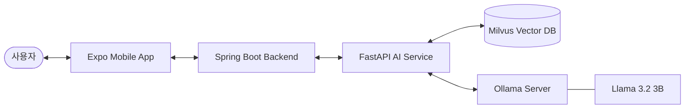

# 🏥 DentiCheck (덴티체크)


DentiCheck는 **AI 기반의 구강 자가 진단 및 개인별 맞춤 관리 서비스**입니다. 사용자가 직접 촬영한 치아 사진을 AI가 정밀 분석하여 구강 상태를 점검하고, 필요한 관리 방법과 치과 방문 권장 사항을 안내합니다.

---

## ✨ 핵심 기능 (Service Key Features)

- 📸 **AI 이미지 분석 (YOLOv8)**: 치석, 충치, 병변 등 주요 구강 질환 징후를 실시간으로 탐지합니다.
- 🤖 **경량 LLM 지능형 상담 (Llama 3.2 3B)**: 로컬 인프라 기반의 안전한 AI가 분석 결과에 따른 전문 상담을 제공합니다.
- 📚 **RAG 기반 신뢰 지식**: 서울대치과병원(SNUDH) 공식 데이터를 기반으로 한 신뢰도 높은 의학 정보 검색 답변을 제공합니다.
- 📊 **맞춤형 리포트 발급**: YOLO 분석 데이터와 사용자 문진을 결합한 종합 구강 건강 분석 보고서를 생성합니다.
- 📱 **멀티 플랫폼 인터페이스**: 관리자를 위한 웹 콘솔과 일반 사용자를 위한 크로스 플랫폼 모바일 앱을 제공합니다.

---

## 🏗️ 시스템 아키텍처 (Architecture)



---

## 🛠️ 기술 스택 (Tech Stack)

### Backend & AI
- **Runtime**: Java 17 (Spring Boot 3.4), Python 3.11 (FastAPI)
- **AI/ML**: Ultralytics (YOLOv8), PyTorch
- **LLM Engine**: Ollama (Llama 3.2 3B)
- **Database**: PostgreSQL (Relational), Milvus (Vector Search)

### Frontend
- **App**: React Native (Expo SDK 52)
- **Web**: React 19 (Vite 기반 Admin Console)

### DevOps
- **Container**: Docker, Docker Compose
- **Search Logic**: LangChain, RAG Pipeline

---

## 🚀 시작하기 (Quick Start)

### 1단계: 인프라 환경 구축 (Infrastructure)

Docker를 사용하여 핵심 데이터베이스 및 AI 엔진을 실행합니다.

```bash
# 프로젝트 루트에서 실행
docker-compose -f docker-compose.local.yml up -d postgres milvus ollama etcd minio
```

**모델 초기 설정 (Llama 3.2 3B)**
```bash
# 모델 다운로드 및 초기화
docker compose -f .\docker-compose.local.yml up ollama-init
```

### 2단계: AI 서비스 실행 (AI Service)

```bash
cd ai
# 의존성 설치 (필요시)
pip install -r requirements.txt

# 서비스 실행 (로컬 개발용)
$env:PYTHONPATH="src"; python -m uvicorn denticheck_ai.api.main:app --reload --port 8000
```

### 3단계: 백엔드 API 실행 (Backend)

```bash
cd api
./gradlew bootRun --args='--spring.profiles.active=local'
```

### 4단계: 프론트엔드 앱 실행 (Mobile App)

```bash
cd app
npm install
npx expo run:android  # 안드로이드 에뮬레이터 실행 필요
```

---

## 📑 상세 문서 보기

- [AI 엔진 상세 설계 및 아키텍처 (Whitepaper)](file:///c:/DentiCheck/denticheck/ai/DentiCheck_AI_Knowledge_System.md)

---

## ⚠️ 주의사항 및 라이선스

- **면책 고지**: 본 서비스의 AI 분석 결과는 스크리닝 용도이며, 최종 진단은 반드시 치과 전문의를 통해 받으셔야 합니다.
- **라이선스**: 본 프로젝트는 전용 라이선스 정책을 따릅니다. 상세 내용은 `LICENSE` 파일을 참조하세요.
