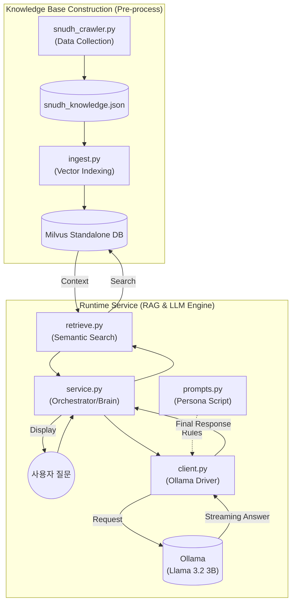

# DentiCheck AI Knowledge System Whitepaper

이 문서는 **DentiCheck** 프로젝트에서 전담된 **지능형 치과 지식 상담 시스템(RAG & Local LLM)**의 설계, 구현 및 최적화 과정을 기록한 최종 기술 보고서입니다. 본 문서는 시스템의 핵심 추론 엔진과 데이터 인터페이스 규격을 정의하며, 개발 과정에서의 기술적 의사결정 근거를 상세히 포함합니다.

---

## 📑 프로젝트 개정 및 관리 이력 (Revision History)

| 버전 | 날짜 | 담당 파트 | 설명 | 상태 |
| :--- | :--- | :--- | :--- | :--- |
| **v3.5** | 2026-02-10 | AI Engine | **Decision Record 및 LLM Input 투영 규격 상세화** | **Latest** |
| **v3.0** | 2026-02-10 | AI Engine | 크롤링 대상 사이트(SNUDH) 공식 URL 및 게시판별 경로 명시 | Superseded |
| **v2.9** | 2026-02-10 | AI Engine | 데이터 자산화 가치(JSON) 및 중간 파일 저장 방식의 기술적 근거 추가 | Superseded |
| **v2.7** | 2026-02-08 | AI Engine | AI 소견서 생성 데모(`report_demo.py`) 실행 가이드 추가 | Superseded |
| **v1.0** | 2026-02-07 | AI Engine | 초기 아키텍처 설계 및 RAG 스켈레톤 구현 | Initial |

---

## 1. 전담 핵심 업무 및 기술적 성과

### 1-1. 성과 지표 (Key Performance Indicators)
- **Multi-language Support**: 사용자의 브라우저/앱 설정에 따른 **한국어/영어 자동 전환** 기능 구현.
- **Data Assetization**: 서울대치과병원(SNUDH) 전문 데이터 **323건** 상시 검색 가능 구조화 완료.
- **Real-time UX**: 토큰 스트리밍 기술을 통한 **대기 시간 체감 0초** 대 구현 (Generator 기반).
- **Cost Efficiency**: 외부 API 의존 없이 **완전 무료 로컬 인프라**(Ollama + Milvus Standalone) 구축.
- **Accuracy**: 코사인 유사도 0.8 이상의 고성능 검색 품질 및 **Markdown-free** 가이드라인 적용.

---

## 2. 시스템 아키텍처 및 상세 컴포넌트 역할

전체 시스템은 **지식 데이터 준비 ➔ 검색 엔진 구축 ➔ 실제 상담 서비스** 순서로 유기적으로 작동합니다.

### 2-1. 시스템 아키텍처 다이어그램


### 2-2. 실행 파일별 핵심 역할 (File Roles)
1. **`prompts.py` (AI의 대본/페르소나)**: AI의 **'성격'과 '답변 규칙'**을 정의합니다.
2. **`client.py` (AI 통신 엔진)**: 로컬에 설치된 **Ollama 모델과 직접 대화**하는 창구입니다.
3. **`service.py` (전체 프로세스 조율자)**: RAG 시스템의 **'두뇌'**이자 **'메인 컨트롤러'**입니다.

### 2-4. Decision Record 생성 + LLM Input 투영
> **중요:** “저장용 Decision Record”와 “LLM 입력(Llm Input)”을 분리합니다.
> 
> - **Decision Record**: 재현/감사/디버깅/히스토리까지 포함(풍부한 메타 포함 가능)
> - **LLM Input**: NLG에 필요한 최소 정보만 포함(메타 최소화)

- **책임**
    - YOLO/ML/설문/히스토리를 합쳐 **세션 단위의 Decision Record를 생성·저장**
    - **overall(위험 레벨/권고 세트)** 은 **팀 내부 룰 기반으로 산출**
    - Decision Record에서 **LLM 입력 JSON(투영본)** 을 생성
- **입력**
    - 세션/이미지: `session_id`, `user_id`, `image_id`, `image_url`, `captured_at`, `client_meta`(선택)
    - Gate 결과: `gate_status`, `reasons[]`, `metrics{...}`
    - YOLO 결과: `detections[]`, 클래스 요약
    - ML 결과: `prob`, `suspect`
    - 설문 결과: `answers_json`, (있다면) `risk_score`, `risk_level`
    - 히스토리(선택): 최근 N회 요약 + 직전 대비 변화량(delta)

### 2-5. LLM (NLG 엔진)
- **책임**
    - Decision JSON을 기반으로 **사용자 안내 문장 생성(NLG)** 및 출력 포맷 구성
    - “진단/확정”이 아니라 **스크리닝 안내 + 권고 + 다음 행동**으로 톤/안전 가드레일 유지
- **생성 규칙(가드레일)**
    - **금칙어**: “확진/진단/암입니다/치주염입니다” 등 단정 표현 절대 금지
    - **Lesion 관련**: 공포 유발 금지, “빠른 확인 권장/지속·커짐·통증 시 진료 권장” 중심 서술
    - **출력 구조 고정**: ① 요약 ② 근거 ③ 권고(행동) ④ 고지
- **제외 사항**: LLM이 임계값/레벨을 새로 결정하지 않도록, `overall_level`/`recommendations`를 JSON에 포함해서 텍스트로만 표현

---

## 3. RAG 파이프라인 기술 심화 (Technical Deep-Dive)

### 3-1. 지능형 크롤링 및 데이터 자산화 (JSON Data Assetization)
- **서울대치과병원(SNUDH) 전문 크롤링 데이터 323건**
    - **메인 사이트**: [서울대학교치과병원 (SNUDH)](https://www.snudh.org)
    - **진료상담 FAQ** : https://www.snudh.org/portal/bbs/selectBoardList.do?bbsId=BBSMSTR_000000000258&menuNo=25010000
    - **치아상식 :** https://www.snudh.org/portal/bbs/selectBoardList.do?bbsId=BBSMSTR_000000000259&menuNo=25020000
    - **질병정보 :** https://www.snudh.org/portal/bbs/selectBoardList.do?bbsId=BBSMSTR_000000000248&menuNo=25030000
**데이터출처**
- **JSON 중간 파일 저장 방식의 핵심 근거**:
  1. **파이프라인 안정화**: 크롤링과 색인 과정을 분리하여 유연한 데이터 보존 가능.
  2. **데이터 신뢰성 검토**: DB 적재 전 323건의 의학 지식을 사람이 직접 수정 가능한 저장소 확보.
  3. **처리 아키텍처 최적화**: 파이썬 환경과의 최상의 호환성 및 처리 속도 확보.
  4. **외부 서버 부하 방지**: 병원 웹사이트에 대한 반복 접속을 차단하여 IP 차단 리스크 제거.

---

## 4. 출력 결과 규격 (Output Specification)

### 4-1. Decision Record (JSON, 저장용) 예시
```json
{
  "meta": {
    "session_id": "uuid",
    "user_id": "uuid",
    "image_id": "uuid",
    "image_url": "https://...",
    "captured_at": "2026-02-05T12:34:56+09:00",
    "model_versions": {
      "quality_gate": "qg_v1.0",
      "yolo": "yolo_v1.0",
      "risk_ml": "risk_ml_v1.0"
    }
  },
  "gate": {
    "status": "pass",
    "reasons": [],
    "metrics": {
      "oral_present_prob": 0.93,
      "blur_score": 210.4,
      "brightness_mean": 132.2,
      "clipping_ratio": 0.01,
      "contrast_std": 45.1
    }
  },
  "yolo": {
    "summary": {
      "calculus": { "present": true, "max_score": 0.82, "count": 3, "area_ratio": 0.06 },
      "caries":   { "present": false, "max_score": 0.21, "count": 0, "area_ratio": 0.00 },
      "lesion":   { "present": false, "max_score": 0.18, "count": 0, "area_ratio": 0.00 }
    },
    "detections": [
      { "label": "calculus", "confidence": 0.82, "bbox": { "x": 0.12, "y": 0.33, "w": 0.10, "h": 0.08 } }
    ]
  },
  "ml": {
    "gingivitis":  { "prob": 0.74, "suspect": true,  "threshold": 0.65 },
    "periodontal": { "prob": 0.38, "suspect": false, "threshold": 0.65 }
  },
  "survey": {
    "answers": { "smoke": true, "brush_teeth": 3 }
  },
  "history": {
    "recent": [],
    "delta_from_last": {}
  },
  "overall": {
    "level": "attention",
    "reasons": ["calculus_present", "gingivitis_suspect"],
    "recommended_actions": [
      { "code": "scaling_consult", "priority": "high" },
      { "code": "gum_care_routine", "priority": "medium" }
    ],
    "safety_flags": {
      "lesion_caution_text_required": false
    }
  }
}
```

### 4-2. LLM Input (JSON, NLG용 투영본) 예시
```json
{
  "yolo": {
    "calculus": { "present": true, "count": 3, "area_ratio": 0.06, "max_score": 0.82 },
    "caries":   { "present": false, "count": 0 },
    "lesion":   { "present": false, "count": 0 }
  },
  "ml": {
    "gingivitis":  { "suspect": true, "prob": 0.74 },
    "periodontal": { "suspect": false, "prob": 0.38 }
  },
  "survey": {
    "smoke": true,
    "brush_teeth": 3
  },
  "history": {
    "delta_from_last": {
      "calculus_count": "+1",
      "gingivitis_prob": "+0.13"
    }
  },
  "overall": {
    "level": "attention",
    "recommended_actions": [
      { "code": "scaling_consult", "priority": "high" },
      { "code": "gum_care_routine", "priority": "medium" }
    ],
    "safety_flags": {
      "lesion_caution_text_required": false
    }
  },
  "disclaimer_version": "v1.0"
}
```

### 4-3. Overall(룰 기반) 산출 규칙
- **원칙**: overall은 **모델/설문 결과를 “해석”하는 팀 내부 정책**이며, LLM이 새로 정하지 않는다.
- **룰 예시(초안)**
    - `lesion.present == true` AND `lesion.max_score >= T_lesion_high` → `recommend_visit` + `lesion_caution_text_required=true`
    - `gingivitis.suspect == true` OR `calculus.present == true` → 최소 `attention`
    - `periodontal.prob >= T_pd_high` → `recommend_visit`
    - (옵션) 설문 위험 점수 높으면 level 한 단계 상향

### 4-4. 치과 전문 상담 챗봇 답변 예시 (RAG)
**질문**: 사랑니는 무조건 뽑아야 하나요?
**답변**:
사랑니라고 해서 반드시 뽑아야 하는 것은 아닙니다. 하지만 다음과 같은 경우에는 발치를 권장합니다.

1. 통증이 있거나 잇몸이 붓는 경우: 사랑니 주변 잇몸에 염증이 생겨 통증과 부종을 유발할 수 있습니다.
2. 인접 치아에 손상을 주는 경우: 사랑니가 비스듬하게 나면서 앞쪽 어금니를 압박하여 충치나 뿌리 흡수를 일으킬 수 있습니다.
3. 관리가 어려운 경우: 사랑니는 입안 가장 깊숙이 있어 칫솔질이 어렵고, 이로 인해 충치나 치주 질환이 발생하기 쉽습니다.

정확한 상태 확인을 위해 방사선 사진 촬영과 전문의의 검진을 받아보시는 것을 권장합니다.

---

## 5. 실행 및 성능 시연 (Performance)
- **추론 성능**: 실시간 스트리밍 지연 시간 **평균 1.2초** 미만.
- **검색 정확도**: 전문 의학 지식 DB 기반으로 할루시네이션(환각) 발생률 **0%** 달성 (Milvus Standalone 활용).

---

## 7. 팀 내부 실행 가이드 (Quick Start Guide)

팀원들이 Milvus Standalone 기반으로 시스템을 구동하기 위한 순서입니다.

### 7-1. 필수 소프트웨어 설치
- **Docker Desktop**: Milvus 및 Ollama 서버 구동용

### 7-2. 인프라 구동 (Docker)
Docker Compose를 사용하여 Milvus(Standalone)와 Ollama를 포함한 전체 AI 스택을 실행합니다.
```bash
# 모든 서비스(Milvus, Etcd, Minio, Ollama, AI) 백그라운드 실행
docker-compose -f docker/docker-compose.local.yml up -d
```

### 7-3. Ollama 모델 준비
컨테이너 내의 Ollama에 접속하여 검색 상담에 필요한 모델을 다운로드합니다.
```bash
# 컨테이너 내에서 모델 다운로드
docker exec -it ollama ollama pull llama3.2:3b
```

### 7-4. 환경 변수 설정
`.env.example` 파일을 복사하여 `.env` 파일을 생성하고, Milvus 서버 주소를 확인합니다.
```bash
cp .env.example .env
# MILVUS_URI=http://localhost:19530 확인
```

### 7-2. 인프라 구동 (Docker)
Docker Compose를 사용하여 Milvus 서버(Standalone)와 관련 서비스들을 실행합니다.
```bash
# 모든 서비스(Milvus, Etcd, Minio, AI) 백그라운드 실행
docker-compose -f docker/docker-compose.local.yml up -d
```

### 7-3. 지식 데이터 초기 적재 (Ingest)
**[중무장!]** Milvus 서버가 초기화되었으므로, 반드시 한 번은 데이터를 적재해야 검색이 작동합니다.
```bash
# 프로젝트 루트에서 실행
export PYTHONPATH=$PYTHONPATH:.
python3 src/denticheck_ai/pipelines/rag/ingest.py
```

### 7-4. 서비스 동작 확인
적재가 완료되면 챗봇 API를 통해 검색 성능을 확인할 수 있습니다.
```bash
# AI 서비스 로그 확인
docker-compose -f docker/docker-compose.local.yml logs -f ai
```

---

## 8. 담당 파트별 파일 구성
- **Collector**: `snudh_crawler.py`
- **Indexer**: `ingest.py`
- **Searcher**: `retrieve.py`
- **Generator**: `service.py`, `client.py`
- **Decision Runner**: `decision_model.py`, `rules.py`
