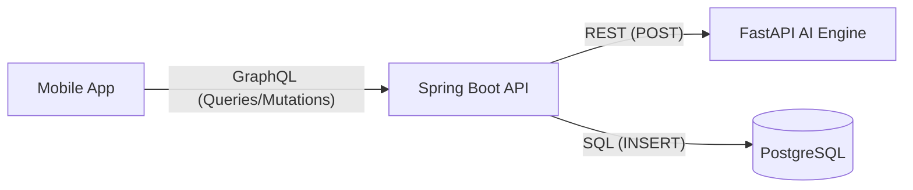

# DentiCheck AI Integration Guide (GraphQL Edition)

백엔드 서버가 **GraphQL**을 사용할 때, AI 엔진과 DB를 연결하는 최적의 아키텍처를 설명합니다.

---

## 🏗️ 1. 데이터 흐름 (GraphQL Proxy)
백엔드 서버가 '중계기' 역할을 하며 보안과 데이터 저장을 동시에 처리합니다.



---

## 🧩 2. 백엔드 구현 사양

### A. GraphQL 스키마 정의 (`schema.graphqls`)
앱 개발자가 사용할 수 있도록 백엔드에서 아래와 같이 스키마를 정의합니다.

```graphql
type Query {
    # AI 챗봇 상담
    aiChat(sessionId: ID!, question: String!, language: String): AiChatResponse!
}

type Mutation {
    # AI 소견서 생성 및 저장 (설계 사양 2-4, 2-5 적용)
    # yoloJson, mlJson 등은 백엔드에서 생성한 Decision Record의 투영본입니다.
    generateAiReport(
        sessionId: ID!, 
        inputJson: String!, # 정밀한 분석 데이터 (JSON String)
        language: String
    ): AiReportResponse!
}

type AiChatResponse {
    answer: String!
    language: String!
}

type AiReportResponse {
    summary: str!      # [NLG 1단계] 한 줄 요약
    details: str!      # [NLG 2,3단계] 상세 분석 및 관리 가이드
    disclaimer: str!   # [NLG 4단계] 면책 고지 및 권고
    language: String!
}
```

### B. 리졸버(Resolver) 연동 로직 예시
백엔드 담당자가 작성할 핵심 "연결" 코드입니다.

```java
@Controller
public class AiResolver {

    @Autowired
    private RestTemplate restTemplate; // AI 서버와 통신용
    @Autowired
    private AiRepository aiRepository; // DB 저장용

    // 1. 챗봇 리졸버 (Query Mapping)
    @QueryMapping
    public Map<String, Object> aiChat(@Argument String question, @Argument String language) {
        // AI 엔진 호출
        AiChatRes res = restTemplate.postForObject("http://ai-server:8000/v1/chat/ask", new ChatReq(question, language), AiChatRes.class);
        
        // [중요] DB에 대화 내역 저장 (ai_chat_messages 테이블)
        saveChatMessageToDb(question, res.getAnswer(), language);
        
        return Map.of("answer", res.getAnswer(), "language", language);
    }

    // 2. 소견서 리졸버 (Mutation Mapping)
    @MutationMapping
    public Map<String, Object> generateAiReport(
            @Argument UUID sessionId,
            @Argument String inputJson, // 'LLM Input 투영본'
            @Argument String language) {
        
        // [중요] 1. '저장용 Decision Record'를 ai_decision_records 테이블에 기록
        // (재현/디버깅을 위해 AI 호출 전 전체 원천 데이터를 보관합니다.)
        saveDecisionRecord(sessionId, inputJson);

        // 2. AI 엔진 호출 (POST /v1/report/generate)
        // inputJson은 이미 정제된 'LLM Input 투영본'이어야 합니다.
        AiReportRes res = restTemplate.postForObject("http://ai-server:8000/v1/report/generate", inputJson, AiReportRes.class);
        
        // [핵심] 3. DB에 3단 소견서 내용 분리 저장 (ai_reports 테이블)
        AiReportEntity report = AiReportEntity.builder()
                .sessionId(sessionId)
                .summary(res.getSummary())
                .details(res.getDetails())
                .disclaimer(res.getDisclaimer())
                .language(language)
                .build();
        aiRepository.save(report);
        
        return Map.of(
            "summary", res.getSummary(),
            "details", res.getDetails(),
            "disclaimer", res.getDisclaimer(),
            "language", language
        );
    }
}
```

---

## 🛠️ 3. 백엔드 담당자에게 전달할 핵심 요약

1.  **AI 서버**: 포트 `8000`번에서 REST API로 대기 중입니다.
2.  **데이터 저장**: 
    - 원천 데이터는 `ai_decision_records`에 **JSONB**로 통째로 넣으세요.
    - AI가 준 3단 가이드(요약/상세/고지)는 `ai_reports`의 각 컬럼에 매핑해 주세요.
3.  **데이터 흐름**: 백엔드가 전체 원천 데이터를 AI에 던지면, AI는 이를 해석해서 텍스트로 가공해 줍니다.

---

💡 **결론**: 앱은 **GraphQL**을 통해 백엔드를 '비서'처럼 부리고, 백엔드는 **REST**로 AI에게 물어본 뒤 결과를 **DB**에 기록하고 다시 앱에게 알려주는 구조입니다.
